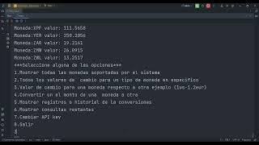

<h1 align="center">Conversor de monedas</h1>

## 📝 Descripcion
Chalenger back-end del programa G6 de alura latam en donde se desarrolló una aplicacion java que convierte devisas por medio de solitudes a una api.
La aplicacion posee una consola que el usuario puede utilizar para hacer todas las operaciones de conversion,
es intuitiva y de facil uso.

## Insignia del desafió

## 🛠️ Caracteristicas del proyecto
La principal caracteristica del conversor de monedas es que permite la conversion de una devisa a otra 
**manteniendo la precision en la parte decimal** debido a que usar `BigDecimal` como variable para almacenar la información.
Por otra parte, posee la caracteristica de guardar un registro en un archivo, filtrarlos por fecha y recuperarlo.
También el conversor cuenta con una consola intuitiva que permite realizar varias operaciones al usuario por debajo se explaya
con mayor de detalle.

### 🔧 Funcionalidades
A continuacion se muestra generalmente las funciones que puede hacer el conversor:
* mostrar las monedas de disponibles para cambiar
* Mostrar el tipo de cambio de una moneda con respecto a otra 
* Realizar conversiones entre monedas 
* Generar un registro de las conversiones
* Recuperar registros y filtrarlos por fecha
* Guardar dinamicamente la api key
* Mostrar información sobre las solicitudes

**Por debajo se encuentra una explicacion sobre lo metodos.**

### 🔥 Funciones del conversor
 * `Map<String,String> availableCurrencies()` devuelve un map que se utiliza para mostrar muestrar todas las monedas disponibles en formato llave-valor,donde las llaves son identificadores regulados por la normativa ISO 4712 y el valor es el nombre de la moneda
 *  `Currency typeExchange(String currency)` devuelve un objeto Currency que en su interior tiene un map que muestra todos los valores de cambio para una moneda solicitada currency recibida como parametro
 *  `Currency pairConversion(String currencyBase, String currencyTarget)` devuelve un objeto que contiene el resultado de la conversion 1 a 1 de una moneda respecto a otra com ejemplo USD como currencyBase y otro target como CLP
 *  `Currency pairConversion(String currencyBase, String currencyTarget, BigDecimal amount)` devuelve un objeto que contiene el resultado de la conversion de una moneda base con respecto a otra y ademas del un monto para realizar la conversion
 *   `Quota quotaRequest()` devuelve un objeto que contiene información sobre la cantidad de request restante,request maximos del plan y día de reseteo

Para más infomacion revisa el apartado de documentacion
### 💽 Demo
En el video debajo se demuestra el funcionamiento del conversor de monedas.

## ⚙️ Instalacion

### 👇 Pasos para la instalacion
   1. ✅ Obtener su API key
   2. ✅ Descargar el JRE de java para poder ejecutarlo
   3. ✅ Clone el proyecto o descárguelo
   4. ✅ Ejecutar el archivo jar que hay dentro

### 1.Obtener la API key
El conversor de monedas utiliza una api-key para funcionar por lo que debe registarse en [ExchangeRateApi](https://www.exchangerate-api.com/) para obtener su api-key luego usted decide qué plan escoger. Una vez registrado active su cuenta y genere su api key.
### 2. Descargar el JRE
Para poder correr la application es necesario tener el entorno de ejecucion pertinente puede [descargarlo](https://www.oracle.com/java/technologies/downloads/) de este enlace en caso de no poseerlo.
### 3. Descargar el proyecto
Descargar el proyecto usando `git clone https://github.com/BaridonFrancisco/Conversor_de_monedas.git` o descargelo desde el link del repositorio
### 4. Ejecute el archivo jar dentro del proyecto
 1. ✅ Pulse Windows + R y escriba cmd, si tiene otro sistema abra la línea de comandos
 2. ✅ Ejecute el siguiente comando `java -jar (rutaAbsoluta del archivo jar)`
 3. ✅ Debera ingresar su API key ya que la aplicacion se la pedira.

**Aquí tiene un ejemplo de la ruta absoluta:** 
`C:\Users\nombre_usuario\Desktop\Alura\Conversor_Monedas\out\artifacts\Conversor_Monedas_jar\Conversor_Monedas.jar`.
>[!IMPORTANT]
> Recuerde cambiar la ruta de desktop y nombre usuario

### 👀 Consideraciones
> [!WARNING]
> Para poder ejecutar la aplicacion es necesario el JRE 17.0.9 o una version superior.

> [!CAUTION]
> No utilice el conversor de monedas para hacer operaciones financieras debido a que puede haber un retraso en la actualizacion de devisas

> [!TIP]
> Hay distintos planes para diferentes cantidades de solicitudes seleccione la que más se adapte a sus necesidades

## Contacto
Apoyame o contactame:
 * [Linkedin](https://www.linkedin.com/in/francisco-baridon/)
 * [GitHub](https://github.com/BaridonFrancisco)
 * [Gmail]()
---

